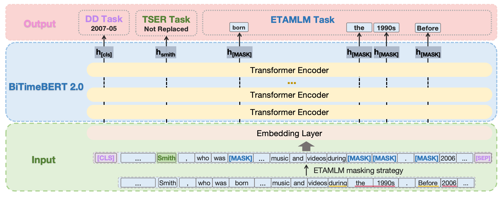

# BiTimeBERT 2.0

This is the repository containing the code for the BiTimeBERT 2.0 model, which incorporates temporal information through three innovative pre-training objectives: Extended Time-Aware
Masked Language Modeling (ETAMLM), Document Dating (DD), and Time-Sensitive Entity Replacement (TSER).

This model represents a substantial extension of our earlier work, BiTimeBERT. First, we refine the Time-Aware Masked Language Modeling (TAMLM) task into Extended Time-Aware Masked Language Modeling (ETAMLM), which additionally incorporates masking of temporal signals that denote temporal relations, such as "before", "after", and "during". This refinement enables the model to achieve a deeper understanding of temporal contexts, surpassing the previous approach that focused solely on masking explicit temporal information. Second, we introduce the time-sensitive entity replacement (TSER) objective, with a particular focus on dynamic "Person" entities, an underexplored yet critical aspect of temporal information. This addition enriches the model’s ability to capture the temporal dynamics associated with individuals, enhancing its versatility in handling time-sensitive content. Third, we implement a pre-training corpus processing strategy that excludes sentences lacking temporal information. This approach allows us to pre-train BiTimeBERT 2.0 on a more specialized temporal news collection, effectively reducing training costs from 80 GPU hours to 38 while preserving high-quality results in most cases.

  

